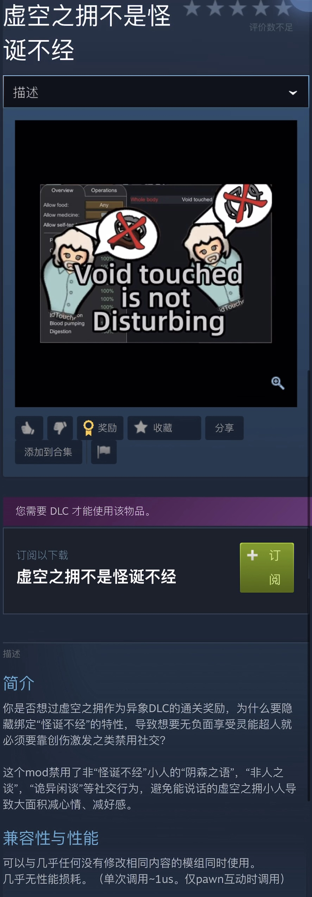

# 【Rimworld模组发布】

### 虚空之拥不是怪诞不经

### Void Touched is not Disturbing

一个简单的修改，但是没找到实现的mod自己写了一个。正义向？

虚空之拥作为异象的最终奖励还要带负面#(怒)本mod修改了虚空之拥的机制。原版虚空之拥小人会被等效赋予隐藏的怪诞不经特性，我修改了触发“阴森之语”等社交行为时额外判断小人是否具有怪诞不经特性，否则不会触发此类负面社交行为。



---

实现方法是非常简单的Harmony Postfix。

原版处理「虚空之拥」Pawn时，他们的社交行为会使用具有特性「怪诞不经」的小人发生负面社交行为时相同的方法。因此通过拦截所有“IsDisturbing”并仅放行具有「怪诞不经」的Postfix来阻止「虚空之拥」的上述行为。

```c#
[StaticConstructorOnStartup]
    public static class HarmonyPatches
    {
        static HarmonyPatches()
        {
            Harmony harmony = new Harmony("rimworld.uranv.voidtouchednotdisturbing");
            harmony.PatchAll();
        }
    }
    [HarmonyPatch(typeof(Pawn_StoryTracker), "IsDisturbing", MethodType.Getter)]
    class Pawn_StoryTracker_IsDisturbing_Patch
    {
        [HarmonyPostfix]
        public static void IsDisturbingPostfix(ref bool __result, Pawn_StoryTracker __instance)
        {
            if (__result && !__instance.traits.HasTrait(TraitDefOf.Disturbing))
            {
                __result = false;
                //Log.Error("[Modify Successed] Patched IsDisturbing for a Void-Touched pawn.");
            }
        }
    }
```

---

完整代码和模组发布与Github仓库：https://github.com/uranv/VoidTouchedIsNotDisturbing

以及Steam创意工坊：https://github.com/uranv/VoidTouchedIsNotDisturbing
